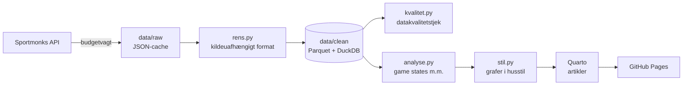

# Superliga Data

**Dansk fodbold set gennem data.** Analyser af Superligaen fra 2020/21 til i dag, med fokus på kampforløb: hvornår målene falder, hvem der holder fast i en føring, og hvordan tabellen ville se ud, hvis kampene stoppede tidligere.

🔗 **Siden:** [aske1122.github.io/superliga-data](https://aske1122.github.io/superliga-data/)

---

## Hvad projektet viser

| Analyse | Spørgsmål |
|---|---|
| **Game states** | Hvor mange minutter har hvert hold været foran, uafgjort og bagud? |
| **Den alternative tabel** | Hvordan ville stillingen se ud efter 15, 30, 45, 60 og 75 minutter? |
| **Comebacks og føringer** | Hvor mange point hentes fra bagud, og hvor mange tabes fra føring? |
| **Scoringstidspunkter** | Hvornår scorer og indkasserer holdene, fordelt på 15-minutters intervaller? |

Alle analyser findes for hver sæson og hvert hold, opdelt i grundspil, slutspil og hele sæsonen. Så kan hold sammenlignes på lige vilkår.

## Data

- **Kilde:** [Sportmonks](https://www.sportmonks.com/) football API v3 (gratisplan). [API-Football](https://www.api-football.com/) bruges som reserve og til krydstjek.
- **Omfang:** 1.212 kampe (Superligaen 2020/21–2026/27) med 3.509 mål, 4.745 kort og 10.808 udskiftninger, alle med minut og hold.
- **Rådata deles ikke.** Kildernes vilkår tillader ikke videredistribution, så `data/` er udeladt af repoet. Siden viser kun egne beregninger og grafer, og ingen logoer eller spillerfotos.

## Arkitektur



| Del | Fil | Hvad den gør |
|---|---|---|
| Budgetvagt | `scripts/budget_guard.py` | Alle API-kald går herigennem: logning, dags- og timeloft med sikkerhedsmargin, pauser, cache og ingen automatiske genforsøg. Gratisgrænserne overskrides aldrig. |
| Hentning | `scripts/hent_sportmonks.py` | Henter en hel sæson med alle hændelser i ét kald (indlejrede includes) i stedet for ét kald pr. kamp. Hele datagrundlaget kostede 10 API-kald. En færdigspillet kamp hentes aldrig igen. |
| Rensning | `scripts/rens.py` | Oversætter kildens format til fire egne tabeller (`kampe`, `maal`, `kort`, `udskiftninger`) med en kolonne for datakilden. En ny kilde kræver kun en ny oversætter, ikke nye analyser. |
| Holdnavne | `scripts/holdnavne.csv` | Fælles holdnavne og forkortelser på tværs af kilder (fx "FC Copenhagen" → FCK). |
| Kvalitet | `scripts/kvalitet.py` | Tjekker hver sæson og hver kamp (se nedenfor). |
| Analyse | `scripts/analyse.py` | Alle beregninger samlet ét sted, så artiklerne importerer dem i stedet for at gentage koden. |
| Grafer | `scripts/stil.py` | Fælles grafstil. Hver graf gemmes som SVG til siden, PNG til deling og i en mobilversion. |
| Website | `index.qmd`, `posts/`, `styles.scss` | Quarto-website. Bygges til `docs/` og publiceres med GitHub Pages. |

## Datakvalitet

Data kontrolleres, før de bruges:

- **Målene skal stemme med resultatet.** For alle 1.206 ligakampe er målene fra hændelserne lagt sammen og sammenlignet med det officielle resultat efter 90 minutter. Resultat: 0 afvigelser.
- **Kildefejl er fundet og rettet i rensningen:**
  - 5 kampe (2024/25) havde mål registreret på det forkerte hold. Holdet udledes i stedet af den løbende stilling (fx 1-0 → 1-1).
  - Kildens "aktuelle stilling" var inkonsistent ved forlænget spilletid. Stillingen efter 90 minutter tages derfor fra slutfløjtet i 2. halvleg.
- **Udskiftningernes retning** (ind/ud) er testet mod spillernes øvrige hændelser.
- **Game states:** For hver kamp skal foran + uafgjort + bagud give 90 minutter, og det ene holds "foran" skal være det andet holds "bagud". Resultat: 0 fejl.
- **Kampe pr. sæson** sammenlignes med det forventede antal (193 med 12 hold).

Metode og begrænsninger er beskrevet på [metodesiden](https://aske1122.github.io/superliga-data/metode.html).

## Teknologi

Python (pandas, DuckDB, matplotlib) · Quarto · GitHub Pages. Skrifterne Inter og Newsreader ligger lokalt (SIL Open Font License 1.1), så siden ikke sender data til tredjepart.

## Kør projektet selv

Kræver Python 3.11+, [Quarto](https://quarto.org/) og en gratis API-nøgle fra Sportmonks.

```bash
python3 -m venv .venv
.venv/bin/pip install -r requirements.txt
.venv/bin/python -m ipykernel install --sys-prefix --name superliga   # Python-kerne til Quarto
cp .env.example .env                                  # indsæt SPORTMONKS_API_KEY
```

```bash
.venv/bin/python scripts/hent_sportmonks.py --plan   # vis hvor mange API-kald en hentning koster
.venv/bin/python scripts/hent_sportmonks.py          # hent (spørger om lov først)
.venv/bin/python scripts/rens.py                     # rådata → egne tabeller
.venv/bin/python scripts/kvalitet.py                 # datakvalitetstjek
.venv/bin/python scripts/analyse.py                  # analysetabeller
quarto render                                        # byg siden til docs/
```

Se siden lokalt med `quarto preview`. Kladder vises kun med `quarto preview --profile kladde`.

## Mappestruktur

```
scripts/        hentning, rensning, kvalitet, analyse og grafstil
posts/          artikler (én mappe pr. artikel med figurer/ og deling/)
docs/           den byggede side (GitHub Pages)
fonts/          Inter og Newsreader med licenser
_skabeloner/    artikellister på forside og arkiv
_partials/      kompakt menu, kampur-læsebjælke og rubrik (lille, ren JavaScript)
data/           rådata og rensede tabeller (ikke i repoet)
```

## Licens

- **Kode:** [MIT](LICENSE). Brug den frit, men bevar copyright-linjen.
- **Tekster og grafer:** [CC BY 4.0](LICENSE-INDHOLD.md). Del og genbrug med kreditering til *Superliga Data*.
- **Rådata** fra Sportmonks er ikke omfattet og deles ikke.

## Krediteringer

- Data: Sportmonks. API-Football til krydstjek.
- Skrifter: [Inter](https://rsms.me/inter/) og [Newsreader](https://github.com/productiontype/Newsreader), [SIL Open Font License 1.1](https://openfontlicense.org/).
- Design inspireret af [Tufte CSS](https://edwardtufte.github.io/tufte-css/) (MIT). Ingen kode er kopieret.
- Bygget med [Quarto](https://quarto.org/).
