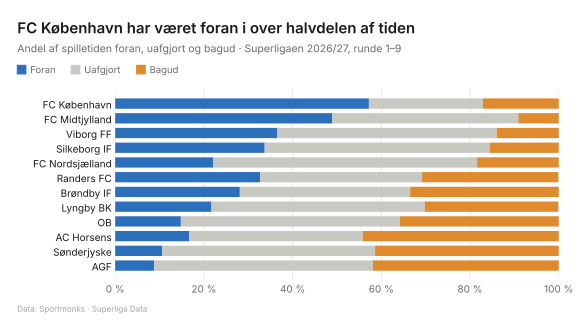

Denne side viser husstilen fra `scripts/stil.py`. Alle grafer på siden skal bruge den.

```{python}
# --- Hent husstilen og analysemodulet ---
import sys
from pathlib import Path
sys.path.insert(0, str(Path("scripts").resolve()))
import stil
import analyse
import matplotlib.pyplot as plt
import numpy as np
from IPython.display import HTML

# --- Farvepaletten som små felter ---
farver = [("Accent (dansk rød)", stil.ACCENT), ("Foran", stil.FORAN), ("Uafgjort", stil.UAFGJORT),
          ("Bagud", stil.BAGUD), ("Tekst", stil.TEKST), ("Grå mørk", stil.GRAA_MOERK),
          ("Grå", stil.GRAA), ("Grå lys (gitter)", stil.GRAA_LYS), ("Baggrund", stil.BAGGRUND)]
felter = "".join(
    f'<div style="display:inline-block;margin:0 1rem 1rem 0;text-align:center;font-size:.8rem">'
    f'<div style="width:90px;height:50px;background:{f};border:1px solid #ddd"></div>{n}<br><code>{f}</code></div>'
    for n, f in farver)
HTML(felter)
```

## Eksempel: game states i husstil

```{python}
# --- Eksempelgraf: andel af tiden foran / uafgjort / bagud, 2026/27 ---
gs = analyse.game_states(analyse.kamp_hold())
g = gs[(gs.saeson == "2026/27") & (gs.fase_gruppe == "hele_saesonen")].sort_values("netto_pct")

fig, ax = stil.figur("FC København har været foran i over halvdelen af tiden",
                     "Andel af spilletiden foran, uafgjort og bagud · Superligaen 2026/27, runde 1–9",
                     venstre=0.2)
stil.game_state_noegle(fig)
venstre = np.zeros(len(g))
for s in ("foran", "uafgjort", "bagud"):
    ax.barh(g.hold, g[f"pct_{s}"], left=venstre, color=stil.GAME_STATE_FARVER[s], height=0.7)
    venstre += g[f"pct_{s}"].to_numpy()
ax.set_xlim(0, 100)
ax.xaxis.set_major_formatter(lambda x, _: stil.pct(x))
stil.gitter(ax)
stil.gem(fig, "stiltest-game-states", "stiltest")
plt.close(fig)
```

{fig-alt="Eksempelgraf i husstilen"}

## Regler

- Titlen er pointen, ikke bare emnet: "FCK har været foran i over halvdelen af tiden", ikke "Game states 2026/27".
- Undertitlen siger, hvad der måles, og hvilken periode det dækker.
- Accentfarven bruges kun til det, grafen handler om. Alt andet er gråt.
- Foran er altid blå, uafgjort grå og bagud orange.
- Hold vises med navn eller forkortelse fra `holdnavne.csv`, aldrig med logoer.
- Hver graf gemmes som SVG til siden og som PNG på 1200×675 pixels til deling (`stil.gem`).
- Tal skrives med decimalkomma (`stil.tal`, `stil.pct`).
